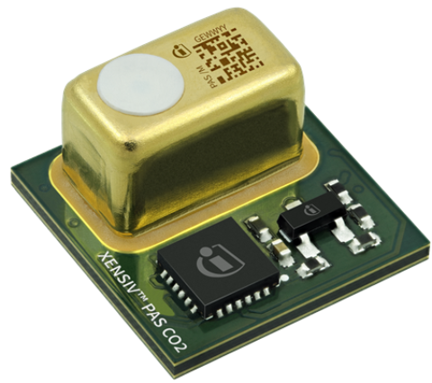
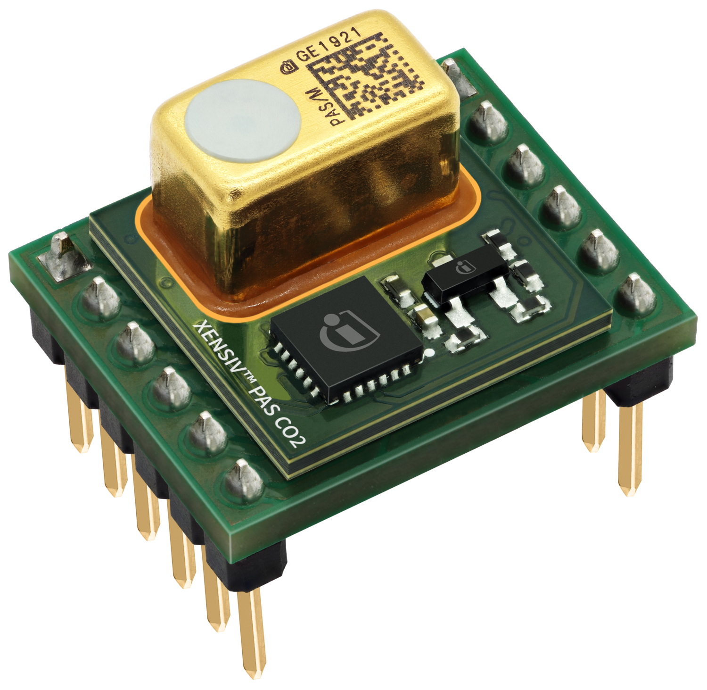
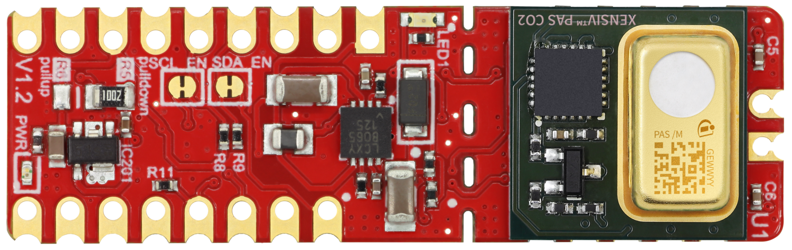

# XENSIV™ PAS CO2 Sensor Arduino Library


Arduino library of Infineon's [**XENSIV™ Photoacoustic Spectroscopy (PAS) CO2**](https://www.infineon.com/cms/en/product/sensor/co2-sensors/) miniaturized sensor.



### Supported Sensor Boards

<table>
    <tr>
        <td></td>
        <td></td>
    </tr>
    <tr>
        <td style="test-align : center"><a href="https://arduino-pas-co2-sensor.readthedocs.io/en/latest/hw-platforms.html#xensiv-pas-co2-miniboard">XENSIV™ PAS CO2 Miniboard</a></td>
        <td style="test-align : center"><a href="https://arduino-pas-co2-sensor.readthedocs.io/en/latest/hw-platforms.html#xensiv-pas-co2-sensor-shield2go">XENSIV™ PAS CO2 Sensor Shield2Go</a></td>
    </tr>
</table>

### Getting started

Find a getting started tutorial based on the XENSIV™ PAS CO2 Shield2Go and the XMC eval boards in this [link](https://arduino-pas-co2-sensor.readthedocs.io/en/latest/getting-started.html).

### Library installation

Look for ```XENSIV PAS CO2``` in the Arduino library manager.

Other installation alternatives [here](https://arduino-pas-co2-sensor.readthedocs.io/en/latest/lib-install.html).

### API reference

Discover all the API features and functions in the [API reference](https://arduino-pas-co2-sensor.readthedocs.io/en/latest/api-ref.html).

### More information

More information can be found in the library [docs](https://arduino-pas-co2-sensor.readthedocs.io/en/latest/index.html).
  
### License

See the [LICENSE](LICENSE.md) file for more details.


