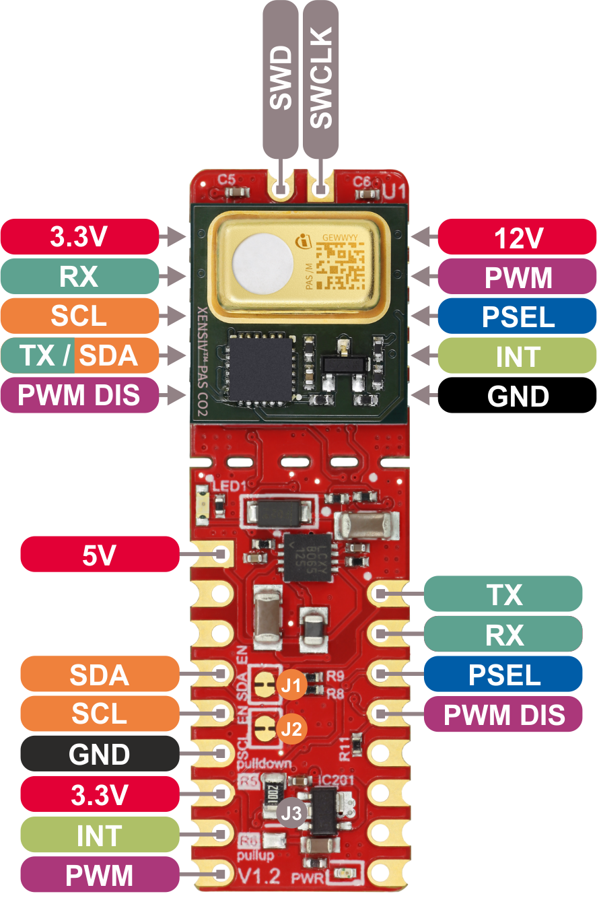
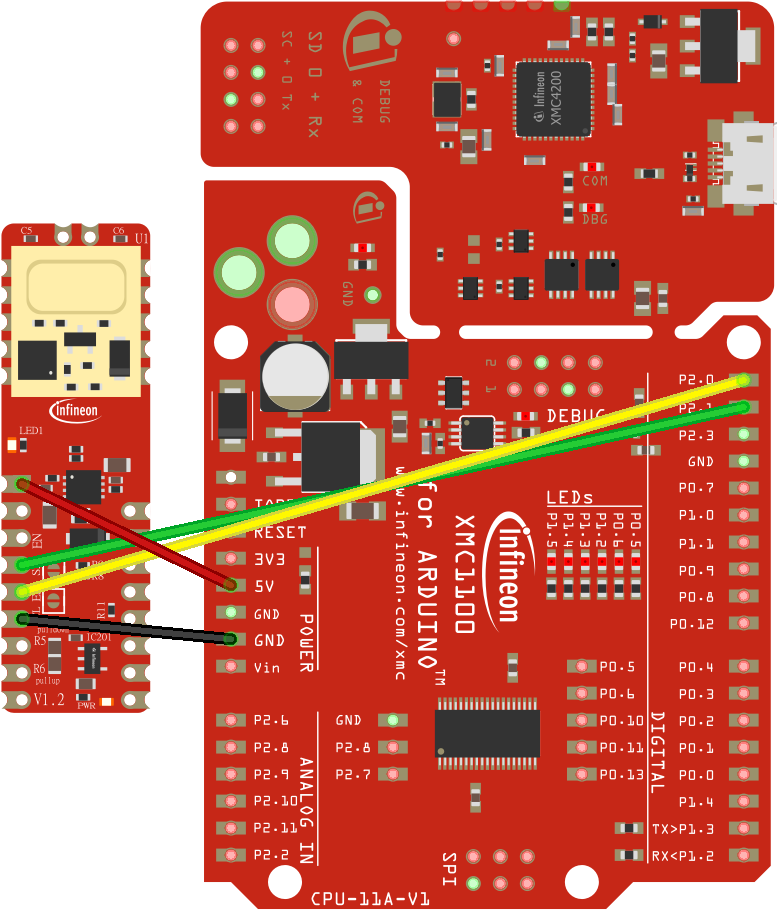
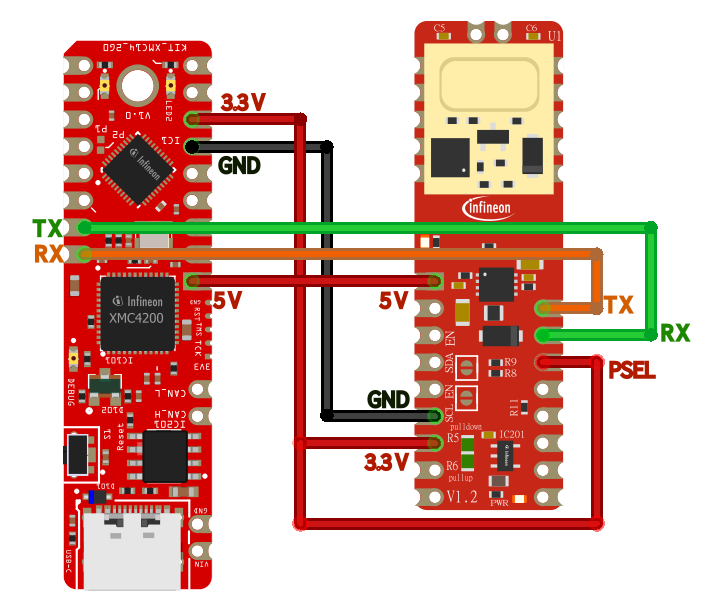
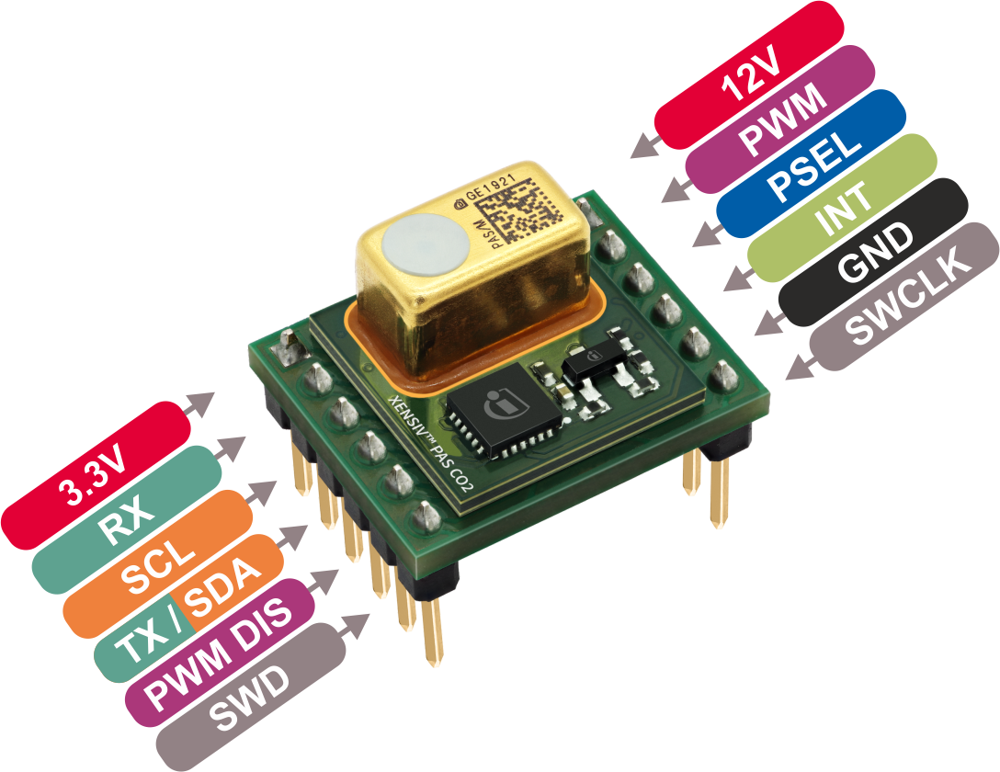
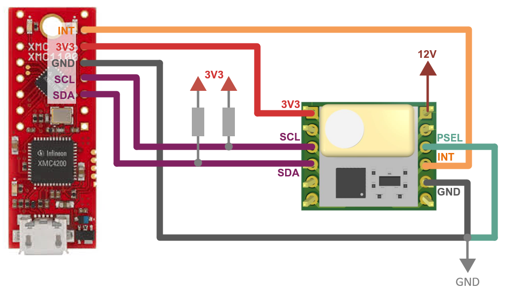
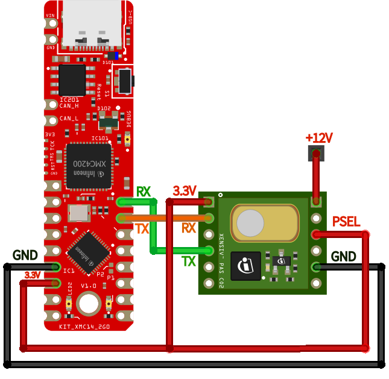

.. _arduino-getting-started:

Getting Started
================

In this quick tutorial we will go through one of the XENSIV™ PAS CO2 sensor examples available using the Shield2Go or the Miniboard and the XMC microcontroller family in Arduino.

Required Hardware
-----------------

.. list-table::
    :widths: 50 50
    :header-rows: 1

    * - Name
      - Picture
    * - `XENSIV™ PAS CO2 Sensor Shield2Go <https://www.infineon.com/cms/en/product/evaluation-boards/shield_pasco2_sensor>`_
      - .. image:: img/pas-co2-s2go-front.png
            :height: 60
    * - or `XENSIV™ PAS CO2 Miniboard <https://www.infineon.com/cms/en/product/evaluation-boards/eval_pasco2_miniboard>`_
      - .. image:: img/pas-co2-miniboard.png
            :height: 80 
    * - `XMC 2Go <https://www.infineon.com/cms/de/product/evaluation-boards/kit_xmc_2go_xmc1100_v1/>`_
      - .. image:: img/xmc2go.jpg
            :height: 80
    * - or `XMC1100 Boot Kit <https://www.infineon.com/cms/en/product/evaluation-boards/kit_xmc11_boot_001/>`_
      - .. image:: img/xmc1100-bootkit.jpg
            :height: 80
    * - Pin headers (included with the XMC 2Go) 
      - 
    * - Micro-USB to USB A cable 
      -

In case of using the miniboard, the following items are also required:

    * Jumper cables
    * 12V DC power supply

Required Software
-----------------

* `Segger J-Link <https://www.segger.com/downloads/jlink>`_
* `Arduino IDE <https://www.arduino.cc/en/main/software>`_
* `XMC-for-Arduino <https://github.com/Infineon/XMC-for-Arduino>`_ 
* `XENSIV™ PAS CO2 Arduino library <https://github.com/Infineon/arduino-pas-co2-sensor>`_

Software Installation
---------------------

1. **Install Arduino IDE**. If you are new to Arduino, please `download <https://www.arduino.cc/en/Main/Software>`_ the program and install it first.

2. **Install XMC Board**. The official Arduino boards are already available in the Arduino software, but other third party boards as the Infineon XMC MCU based need to be explicitly included. Follow the instructions in the `link <https://github.com/Infineon/XMC-for-Arduino#installation-instructions>`_ to add the XMC board family to Arduino. Do not forget to install as well the JLink software.

3. **Install the library**. In the Arduino IDE, go to the menu *Sketch > Include library > Library
   Manager*. Type **XENSIV PAS CO2** and install the library.

    .. image:: img/ard-library-manager.png
        :width: 500

Hardware Setup
--------------

For this example we are going to use the I2C and UART interface. 

A. Shield2Go
""""""""""""
1. I2C
""""""

If you are using the XENSIV™ PAS CO2 Sensor Shield2Go, it is recommended to use a microcontroller
which provides a 5V output. In this tutorial, the XMC11000 Boot
Kit is used. Connect the shield and the eval kit as in the following wiring diagram for I2C:

Be sure that the corresponding solder jumper are set for I2C mode, and PSEL is pulled
to GND. 
For this example it is not required, but consider connecting the interrupt signal to the pin 2(P1.4)
or 3(P0.0) of the XMC1100 Boot Kit for appliations that require interrupts.
Check the `Shield2Go Manual <https://www.infineon.com/dgdl/Infineon-Quickstart_guide_PAS_CO2_Shield2go-UserManual-v01_00-EN.pdf?fileId=8ac78c8c7f2a768a017f6ab96bf11845>`_ for complete details.

Then, simply connect the eval kit to the computer with the USB cable. 

.. warning:: 
    Alternatively, the XMC 2Go can be used by stackin the sensor shield on top. But the XMC 2Go V1 does not support 5V signal, as required by the XENSIV™ PAS CO2 Sensor Shield2Go.
    Thus, if XMC 2Go is used, keep in mind that an additional 5V signal needs to be provided to the 5V pin of the XENSIV™ PAS CO2 Sensor Shield2Go.
2. UART
"""""""
   
In order to use the UART interface we need to connect PSEL pin to 3.3v. Connect the shield and the eval kit as in the following diagram for UART.

B. Miniboard
""""""""""""

1. I2C
""""""
   
In order to use the I2C interface we need to add a 10 Kohm pull-up resistors to the SDA and SCL lines, and a 12VDC voltage needs to be additionally provided to VDD12V pin. Connect the boards as shown in the following diagram:

You need to provide a 12V DC signal to for the emitter. 
Then, simply connect it to the computer with the USB cable. 

**Note** |:warning:| : If the pin headers provided are not press-fit you will need to solder them on the corresponding boards. Otherwise, use your preferred way of connecting the hardware. 

2. UART
"""""""
   
In order to use the UART interface we need to connect PSEL pin to 3.3v, and a 12VDC voltage needs to be additionally provided to VDD12V pin. Connect the boards as shown in the following diagram:

Ready To Go!
------------

With everything ready, now we are going to upload and run one of the library examples. 

1. **Select the board** 

    Once installed the XMC board family, you can select one of the supported board from the menu *Tools > Board:*.
    Choose the **XMC1100 XMC2Go** or **XMC1100 Boot Kit** depending on your hardware setup (*Tools >
    Board > XMC Family > XMC1100 XMC2Go/XMC1100 Boot Kit*).

2. **Open the example**

    With the library installed in the Arduino IDE, you can include it from the menu *Sketch >
    Include Library > XENSIV PAS CO2*. The header ``#include <pas-co2-ino.hpp>`` will be added to your
    sketch. 
    In this case, open and run one of the examples provided in  *File > Examples > XENSIV PAS CO2*.

    Let´s try the continuous mode example for I2C: *File > Examples > XENSIV PAS CO2 > continuous-mode*.

    Let´s try the continuous mode example for UART: *File > Examples > XENSIV PAS CO2 > continuous-mode-uart*. 
 

3. **Build and run the example**

    Select the proper COM port ( *Tools > Port*), and then verify |ver-but| the example and upload it the target |upl-but| . 

    Finally, we can check the monitor output |ser-but|. Do not forget to select the proper baudrate for the serial terminal. You can blow into the sensor to see how the CO2 values change |:smiley:|. 

    .. image:: img/ard-monitor-example.png
        :width: 500

What's next?
------------

This is just the start |:rocket:| !

Check out the rest of the available :ref:`library examples <lexamples>` and find out more about the library functions in the :ref:`API reference <api-ref>` section.
