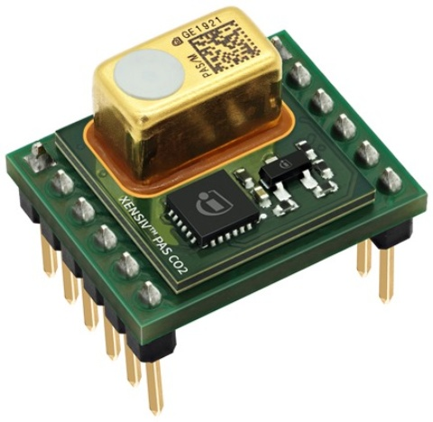

Hardware Platforms
==================

Supported Sensor Boards
-----------------------

This library can support any break-out board or (PAS) XENSIV™ CO2 Sensor based kit.

.. image:: img/pas-co2-module.png
    :width: 200

* `PAS CO2 Stand-alone module product page <https://www.infineon.com/cms/en/product/sensor/co2-sensors>`_
* `PAS CO2 Sensor documentation <https://www.infineon.com/cms/en/product/sensor/co2-sensors/#!documents>`_

The following kits can be integrated in Arduino compatible MCUs and are supported by this library:

PAS CO2 Sensor Shield2Go
""""""""""""""""""""""""

 .. image:: img/pas-co2-s2go-front.jpg
    :width: 300

* `PAS CO2 Shield2Go product page <http://www.notfound.com>`_ (Coming soon)
* `Quick Start Guide S2Go <http://www.notfound.com>`_ (Coming soon)(for Arduino)

PAS CO2 Miniboard
"""""""""""""""""""

* `PAS CO2 Miniboard product page <https://www.infineon.com/cms/en/product/evaluation-boards/eval_pasco2_miniboard>`_
* `PAS CO2 Miniboard documentation <https://www.infineon.com/cms/en/product/evaluation-boards/eval_pasco2_miniboard/#!documents>`_

Supported MCU Platforms
-----------------------

In principle, the library is supported by any Arduino compatible MCU platform.
Its Arduino core needs to implement the `Arduino reference language <https://www.arduino.cc/reference/en/>`_ and the `Wire <https://www.arduino.cc/en/Reference/Wire>`_ built-in Arduino library.

Verified MCU Boards
"""""""""""""""""""
The library examples have been built and successfully executed on the following hardware platforms:

.. list-table::
    :header-rows: 1

    * - MCU Platforms
    * - `XMC 2Go <https://www.infineon.com/cms/en/product/evaluation-boards/kit_xmc_2go_xmc1100_v1>`_
    * - `XMC1100 Boot Kit <https://www.infineon.com/cms/en/product/evaluation-boards/kit_xmc11_boot_001>`_
    * - `Arduino Uno Rev3 <https://store.arduino.cc/arduino-uno-rev3>`_

Find out which boards are build checked under continuous integration `here <https://github.com/Infineon/arduino-pas-co2-sensor/blob/master/.github/workflows/build-check.yml>`_.