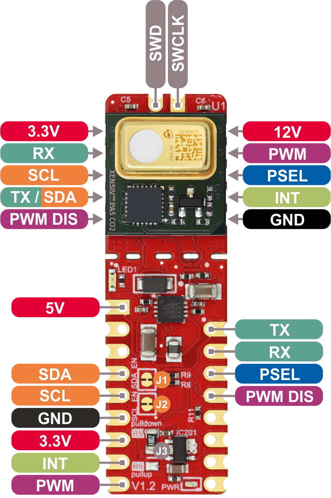
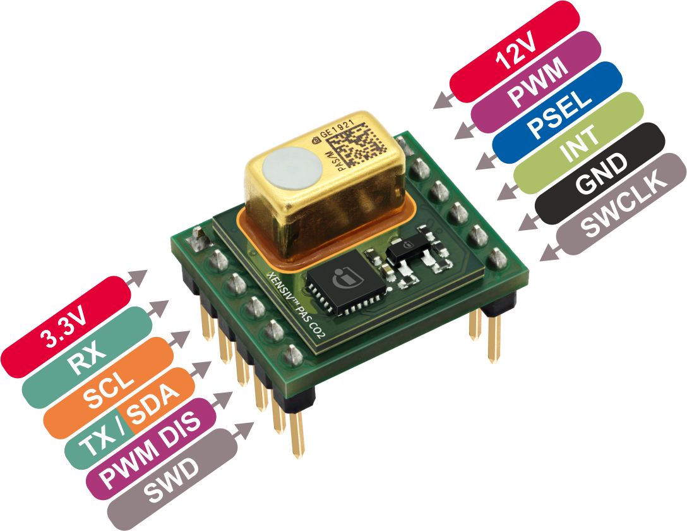

Hardware Platforms
==================

Supported Sensor Boards
-----------------------

This library can support any break-out board or (PAS) XENSIV™ CO2 Sensor based kit.

.. image:: img/pas-co2-module.png
    :width: 200

* `XENSIV™ PAS CO2 Stand-alone module product page <https://www.infineon.com/products/sensor/gas-sensors/co2-sensors#products>`_
* `XENSIV™ PAS CO2 Sensor documentation <https://www.infineon.com/products/sensor/gas-sensors/co2-sensors#products/#!documents>`_

The following kits can be integrated in Arduino compatible MCUs and are supported by this library:

XENSIV™ PAS CO2 Sensor Shield2Go
""""""""""""""""""""""""""""""""

 .. image:: img/pas-co2-s2go-front.png
    :width: 300

* `XENSIV™ PAS CO2 Shield2Go product page <https://www.infineon.com/evaluation-board/SHIELD-PASCO2-SENSOR/>`_
* `Quick Start Guide Shield2Go <https://www.infineon.com/assets/row/public/documents/24/44/infineon-quickstart-guide-pas-co2-shield2go-usermanual-en.pdf>_ (for Arduino)

Pinout Diagram
^^^^^^^^^^^^^^

.. warning:: 
    All signal pins run on 3.3V logic!

Pin Description
^^^^^^^^^^^^^^^

.. list-table::
    :header-rows: 1

    * - Pin Name
      - Description
    * - 5V
      - 5V supply input.
    * - SDA
      - I2C SDA (serial data).
    * - SCL
      - I2C SCL (serial clock).
    * - GND
      - Supply and signal ground.
    * - 3.3V
      - 3.3V supply input - use as logic supply when using breakable part stand-alone, else keep NC.
    * - INT
      - Interrupt output.
    * - PWM
      - PWM signal output.
    * - TX
      - UART transmit side.
    * - RX
      - UART receive side.
    * - PSEL
      - Communication interface selection.
    * - PWM DIS
      - PWM disable input (set high to disable PWM).
    * - 12V
      - 12V supply input - use as sensor supply when using breakable part stand-alone, else keep NC.
    * - TX/SDA
      - UART transmit or I2C SDA (serial data), depending on selected communication interface.
    * - SWD
      - Serial wire debug data (keep NC).
    * - SWCLK
      - Serial wire debug clock (keep NC).

XENSIV™ PAS CO2 Miniboard
"""""""""""""""""""""""""

.. image:: img/pas-co2-miniboard.png
    :width: 200

* `XENSIV™ PAS CO2 Miniboard product page <https://www.infineon.com/evaluation-board/EVAL-PASCO2-MINIBOARD>`_
* `XENSIV™ PAS CO2 Miniboard documentation <https://www.infineon.com/evaluation-board/EVAL-PASCO2-MINIBOARD#documents>`_

Pinout Diagram
^^^^^^^^^^^^^^

Pin Description
^^^^^^^^^^^^^^^

.. list-table::
    :header-rows: 1

    * - Pin Name
      - Description
    * - SDA
      - I2C SDA (serial data).
    * - SCL
      - I2C SCL (serial clock).
    * - GND
      - Supply and signal ground.
    * - 3.3V
      - 3.3V logic supply input (required).
    * - INT
      - Interrupt output.
    * - PWM
      - PWM signal output.
    * - RX
      - UART receive side.
    * - PSEL
      - Communication interface selection.
    * - PWM DIS
      - PWM disable input (set high to disable PWM).
    * - 12V
      - 12V sensor supply input (required).
    * - TX/SDA
      - UART transmit or I2C SDA (serial data), depending on selected communication interface.
    * - SWD
      - Serial wire debug data (keep NC).
    * - SWCLK
      - Serial wire debug clock (keep NC).

Supported MCU Platforms
-----------------------

In principle, the library is supported by any Arduino compatible MCU platform.
Its Arduino core needs to implement the `Arduino reference language <https://www.arduino.cc/reference/en/>`_ and the `Wire <https://www.arduino.cc/en/Reference/Wire>`_ built-in Arduino library.

Verified MCU Boards
"""""""""""""""""""
The library examples have been built and successfully executed on the following hardware platforms for I2C:

.. list-table::
    :header-rows: 1

    * - MCU Platforms
    * - `XMC 2Go <https://www.infineon.com/evaluation-board/KIT-XMC14-2GO>`_
    * - `XMC1100 Boot Kit <https://www.infineon.com/evaluation-board/KIT-XMC11-BOOT-001>`_
    * - `Arduino Uno Rev3 <https://store.arduino.cc/arduino-uno-rev3>`_

Find out which boards are build checked under continuous integration `here <https://github.com/Infineon/arduino-pas-co2-sensor/blob/master/.github/workflows/compile_examples.yml>`_.