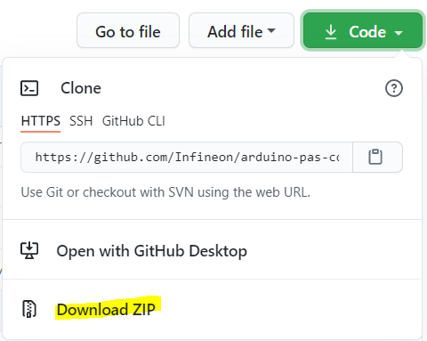

Library Installation
====================

The library can be installed in several ways:

* Arduino IDE Library Manager 
* Arduino IDE Import .zip library
* Arduino IDE manual installation
* PlatformIO

These installation processes are conveniently described in the official Arduino `website <https://www.arduino.cc/en/guide/libraries>`_.

Library Manager
---------------

Library name: ```pas-co2-sensor```

Manual Installation
-------------------

Download the desired .zip library version from the repository `releases <https://github.com/Infineon/arduino-pas-co2-sensor/releases>`_ section.
 
|:warning:| As a general recommendation, direct downloads from the master branch should be avoided. Even if it should not, it could contain incomplete or faulty code.




PlatformIO
----------

If you are a `PlatformIO <https://platformio.org>`_ user, you have also this library available in the PlatformIO register.

With the project created, now the library and its dependencies can be configured in the ***Platform.ini* Project File**. This file, located in the project root folder, includes one (or several) building environments *[env:__]*.

In the *environment* section, the platform, board, and framework are specified. PlatformIO will take care of downloading and installing all dependencies.

In the following example, we use the XMC 2Go Evaluation Kit (only available for Arduino):

.. code-block::

    [env:xmc1100_xmc2go]
    platform = infineonxmc
    board = xmc1100_xmc2go
    framework = arduino

    lib_deps =
        infineon/pas-co2-sensor @ ^1.0.3


Find more information in the `PlatformIO Registry <https://platformio.org/lib/show/12518/pas-co2-sensor>`_.
